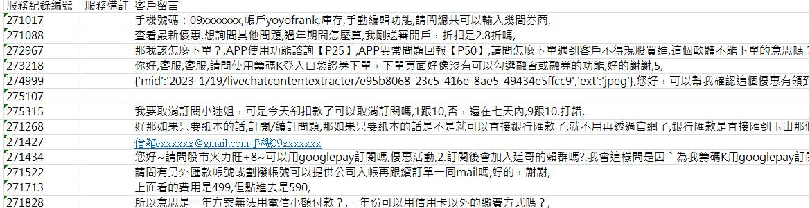
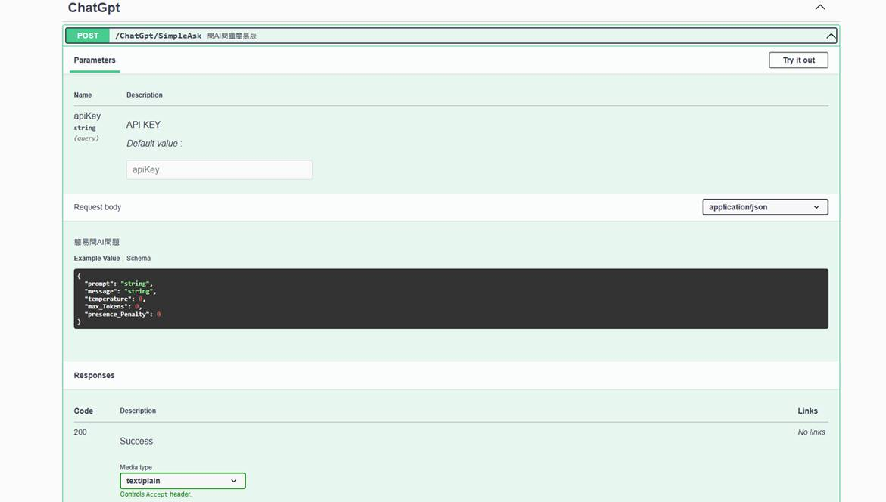
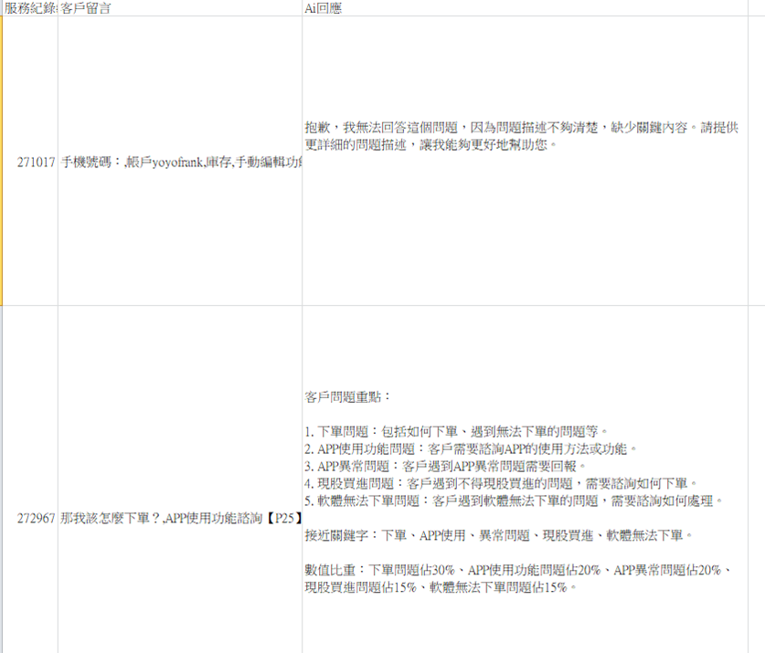
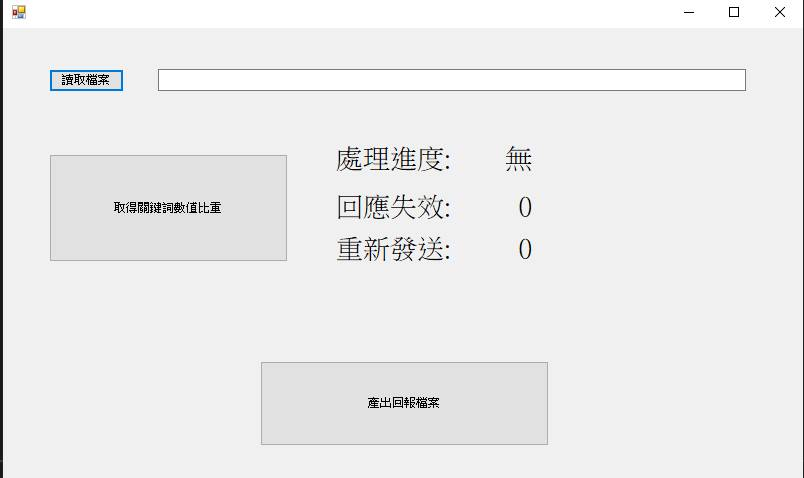

# KeyWordExtraction
send customer question to sever api which connect to chapgpt and get keyword respond and analysis

senario: we now have custom question records and we want to analyze the question categories ratio. The analysis requirement is achieved by chatgpt, so we need to design a program to read the file of custom problems, filter confidential data like phone or email, send to api, and get resonse, then make results a file to report.

problem example: 

api schema: 

respond example:

exefileExample:

